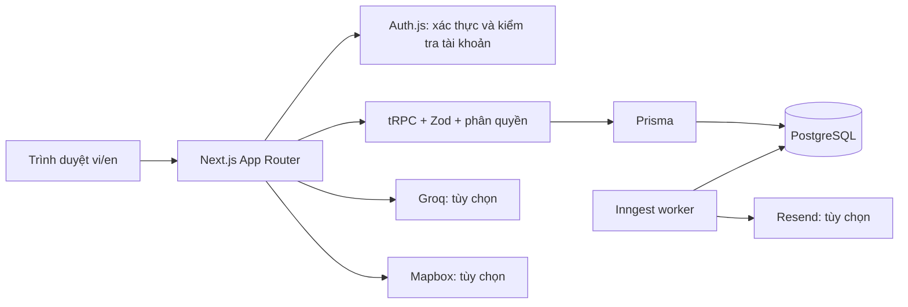
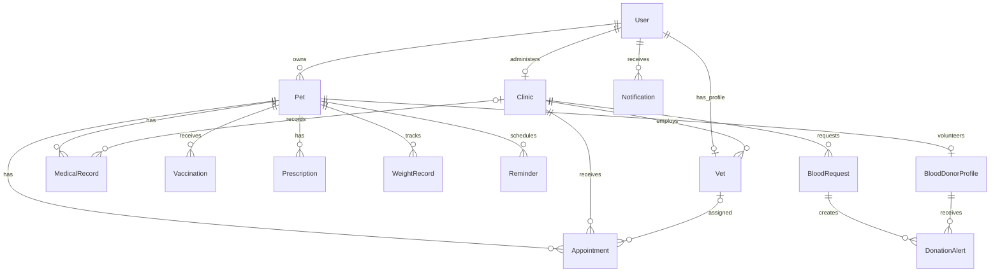
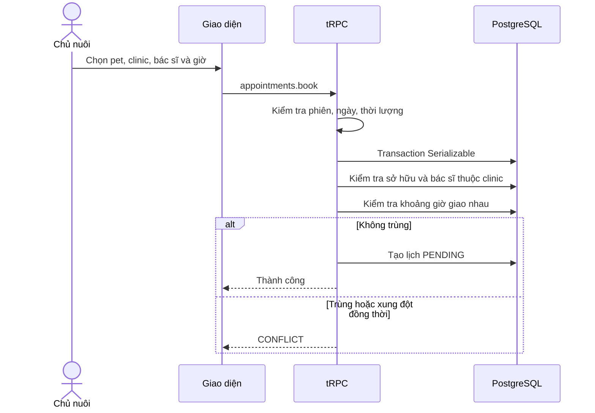

# Thiết kế hệ thống PetCare

## Phạm vi và vai trò

Chủ nuôi quản lý hồ sơ, lịch khám và đồng ý hiến máu. Bác sĩ ghi hồ sơ lâm sàng cho bệnh nhân có quan hệ với phòng khám. Quản trị phòng khám quản lý lịch, trạng thái và bác sĩ thuộc đơn vị. Quản trị hệ thống xét duyệt đơn đăng ký phòng khám.

## Kiến trúc

## ERD rút gọn

Schema chính xác, đầy đủ khóa và chỉ mục nằm trong `prisma/schema.prisma` và migration baseline.

## Trình tự đặt lịch

## Ràng buộc nghiệp vụ

- Lịch hẹn bắt đầu trong tương lai; thời lượng nguyên 15–180 phút.
- Trùng giờ được xét cho cùng thú cưng hoặc bác sĩ được chỉ định. Chưa triển khai mô hình số phòng/giường và năng lực tiếp nhận chung của phòng khám.
- Luồng trạng thái: PENDING → CONFIRMED → IN_PROGRESS → COMPLETED; PENDING/CONFIRMED có thể hủy; CONFIRMED có thể đánh dấu vắng.
- API đổi trạng thái kiểm tra clinic của lịch, không suy ra từ lịch sử khám của pet.
- Nhắc lịch lặp tạo lần tiếp theo ở thời điểm tương lai, không gửi dồn mọi lần quá hạn khi worker được khởi động lại.
- Đăng ký hiến máu là hồ sơ chờ sàng lọc. Ghép nhóm máu trong phần mềm chỉ giúp điều phối; quyết định lâm sàng nằm ở phòng khám.

Đây là tài liệu kỹ thuật của mã nguồn, chưa thay thế báo cáo học thuật theo biểu mẫu của trường. Phần tổng quan nghiên cứu, khảo sát người dùng, phân công nhóm và nhận xét giảng viên cần dữ liệu thực tế của nhóm.
